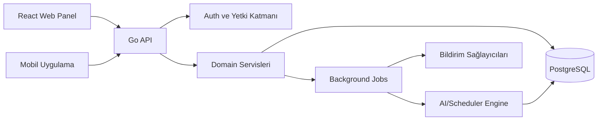

# Sistem Mimarisi

## Mimari Yaklaşım

Platform modüler monolit olarak başlatılmalıdır. İlk aşamada mikroservis mimarisine geçmek gereksiz operasyonel yük oluşturur. Go backend içinde modüller net sınırlarla ayrılır; ihtiyaç büyürse zamanlama motoru, bildirim servisi veya AI analiz servisi ayrı servisler haline getirilebilir.

## Ana Bileşenler



## Backend Katmanları

Önerilen Go yapısı:

```text
backend/
  cmd/
    api/
      main.go
  internal/
    app/
      school/
      scheduling/
      attendance/
      observation/
      notification/
    domain/
      school/
      scheduling/
      attendance/
      observation/
      identity/
    http/
      middleware/
      handlers/
      dto/
    repository/
      postgres/
    platform/
      auth/
      config/
      logger/
      clock/
      queue/
  migrations/
```

Katman sorumlulukları:

- `domain`: İş kuralları ve domain modelleri.
- `app`: Use-case servisleri. Transaction sınırları çoğunlukla burada yönetilir.
- `http`: Request/response, validation, middleware ve API adaptörleri.
- `repository/postgres`: PostgreSQL veri erişimi.
- `platform`: Auth, config, loglama, zaman, dış servis adaptörleri.

## Frontend Katmanları

Önerilen yapı:

```text
frontend/
  apps/
    web/
    mobile/
  packages/
    api-client/
    ui/
    auth/
    domain-types/
```

Web uygulaması müdür, yönetici ve rehberlik birimine odaklanır. Mobil uygulama öğretmen ve veli akışlarına odaklanır.

## Veritabanı Yaklaşımı

- PostgreSQL ana veritabanıdır.
- Tüm kurum verilerinde `tenant_id` bulunmalıdır.
- İlk aşamada uygulama katmanında tenant scope zorunlu tutulur.
- Büyüme aşamasında PostgreSQL Row Level Security değerlendirilebilir.
- Migrasyonlar versiyonlu tutulmalıdır.
- UUID primary key önerilir.

## Kritik Domain Modülleri

- Identity and Access: kullanıcı, rol, kapsam, oturum
- Institution Management: kurum, kampüs, akademik yıl, dönem
- People: öğretmen, öğrenci, veli, rehberlik personeli
- Class Management: sınıf/şube, öğrenci yerleşimi
- Scheduling: ders, öğretmen uygunluğu, haftalık ihtiyaç, ders programı
- Attendance: yoklama oturumu, öğrenci yoklama durumu, veli bildirimi
- Observation: öğretmen gözlemi, rehberlik takibi, hassas kayıtlar
- Notification: duyuru, devamsızlık bildirimi, mobil push altyapısı
- Reporting: dashboard ve yönetim özetleri

## Ölçekleme İlkesi

İlk sürümde tek Go API, tek PostgreSQL ve background job altyapısı yeterlidir. Aşağıdaki belirtiler oluşmadan modül ayrıştırılmamalıdır:

- Ders programı üretimi API performansını belirgin etkiliyorsa
- Bildirim hacmi senkron istekleri yavaşlatıyorsa
- AI analiz işleri uzun süreli job haline geldiyse
- Kurum sayısı ve veri hacmi raporlama sorgularını ağırlaştırıyorsa

Bu durumda önce job queue ve read model optimizasyonu, sonra servis ayrıştırma düşünülmelidir.

