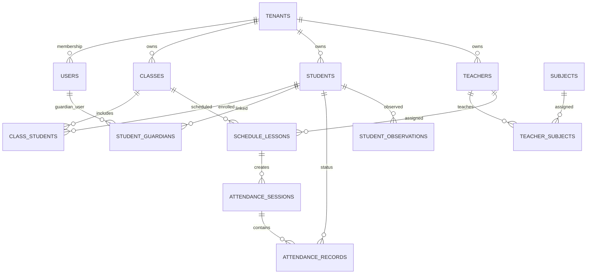

# Veri Modeli

## Temel İlkeler

- Her kurum verisi `tenant_id` ile ayrılmalıdır.
- Silme işlemleri çoğu ana tabloda soft delete olarak tasarlanmalıdır.
- Hassas öğrenci ve rehberlik verileri ayrı tablolarda tutulmalıdır.
- Audit gerektiren işlemler için `created_by`, `updated_by` ve audit log kayıtları kullanılmalıdır.
- Tarih/saat alanları UTC saklanmalı, kurum timezone bilgisi sunum katmanında kullanılmalıdır.

## Ana Varlıklar

### SaaS ve Kurum

- `tenants`: Kurum hesabı.
- `tenant_branches`: Kampüs/şube.
- `academic_years`: Akademik yıl.
- `terms`: Dönem.

### Kimlik ve Yetki

- `users`: Tüm kullanıcıların ortak hesabı.
- `tenant_memberships`: Kullanıcının kurum içindeki üyeliği.
- `roles`: Rol tanımları.
- `permissions`: Yetki tanımları.
- `role_permissions`: Rol-yetki ilişkisi.
- `user_scopes`: Kullanıcının sınıf, öğrenci veya kampüs kapsamı.

### Kişiler ve Eğitim Yapısı

- `teachers`: Öğretmen profili.
- `students`: Öğrenci profili.
- `guardians`: Veli profili.
- `student_guardians`: Öğrenci-veli ilişkisi.
- `classes`: Sınıf/şube.
- `class_students`: Öğrenci-sınıf ilişkisi.
- `subjects`: Dersler.
- `teacher_subjects`: Öğretmen-ders ilişkisi.
- `class_subject_requirements`: Sınıfın haftalık ders saat ihtiyacı.

### Ders Programı

- `teacher_availabilities`: Öğretmen müsaitlikleri.
- `schedule_generation_jobs`: Program üretim işleri.
- `schedules`: Program başlığı ve versiyonu.
- `schedule_lessons`: Programdaki ders blokları.
- `schedule_change_logs`: Manuel değişiklik ve yayın geçmişi.

### Yoklama

- `attendance_sessions`: Ders bazlı yoklama oturumu.
- `attendance_records`: Öğrenci yoklama durumu.
- `attendance_notifications`: Veliye iletilen veya bekleyen bildirimler.

### Gözlem ve Rehberlik

- `student_observations`: Öğretmen gözlemleri.
- `guidance_cases`: Rehberlik takip dosyası.
- `guidance_notes`: Görüşme ve takip notları.
- `support_plans`: Destek planları.
- `risk_signals`: AI veya kural tabanlı erken uyarı sinyalleri.

### Bildirim ve Duyuru

- `announcements`: Kurum duyuruları.
- `announcement_audiences`: Hedef kitle.
- `notifications`: Kullanıcı bazlı bildirim kayıtları.
- `device_tokens`: Mobil push token kayıtları.

### Denetim

- `audit_logs`: Hassas veya yönetimsel işlemlerin logları.
- `login_events`: Oturum açma kayıtları.

## İlişki Özeti

## MVP İçin Minimum Tablo Seti

İlk migrasyon setinde aşağıdaki tablolar yeterlidir:

- `tenants`
- `users`
- `tenant_memberships`
- `roles`
- `permissions`
- `role_permissions`
- `academic_years`
- `terms`
- `classes`
- `students`
- `guardians`
- `student_guardians`
- `teachers`
- `subjects`
- `teacher_subjects`
- `class_subject_requirements`
- `teacher_availabilities`
- `schedules`
- `schedule_lessons`
- `attendance_sessions`
- `attendance_records`
- `announcements`
- `notifications`
- `student_observations`
- `audit_logs`

## Veri Tutarlılığı Kuralları

- Bir öğretmen aynı saat aralığında iki farklı derse atanamaz.
- Bir sınıf aynı saat aralığında iki farklı derse atanamaz.
- Bir öğrenci aynı anda birden fazla aktif sınıf kaydına sahip olmamalıdır.
- Veli yalnızca `student_guardians` ilişkisi bulunan öğrenciyi görebilir.
- Yoklama kaydı yayınlanmış veya aktif programdaki ders bloğuna bağlanmalıdır.
- Rehberlik verileri öğretmen gözlem verilerinden ayrı erişim seviyesinde tutulmalıdır.

