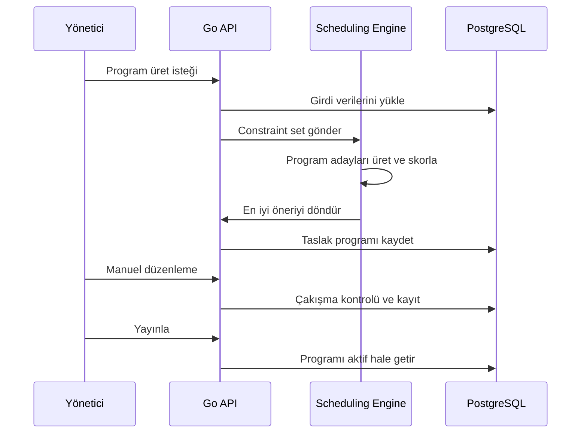

# AI Destekli Ders Programı

## Amaç

Ders programı modülü; kurumun sınıf, ders, öğretmen, haftalık ders saati ve müsaitlik verilerine göre uygulanabilir bir haftalık program önerisi üretmelidir. Yönetici bu öneriyi manuel düzenleyebilmeli ve yayınlayabilmelidir.

## Kritik Mimari Karar

Ders programı üretiminde hard constraint'ler LLM'e bırakılmamalıdır. Çakışma, saat, sınıf ve öğretmen uygunluğu gibi kurallar deterministik bir solver veya kural motoru tarafından garanti edilmelidir.

AI desteği şu alanlarda konumlandırılabilir:

- Uygun program önerilerinin skorlanması
- Çakışma nedenlerinin açıklanması
- Alternatif çözüm önerilerinin sunulması
- Soft constraint optimizasyonu
- Yöneticinin manuel değişiklikleri için uyarı üretimi

## Girdi Verileri

- Kurum çalışma günleri
- Günlük ders saat blokları
- Sınıflar
- Dersler
- Sınıf bazlı haftalık ders saatleri
- Öğretmenler
- Öğretmen-ders yetkinlikleri
- Öğretmen müsaitlikleri
- Ders çakışma kuralları
- Öğle arası ve özel bloklar

## Hard Constraint'ler

Bu kurallar ihlal edilemez:

- Bir öğretmen aynı zaman diliminde tek derse girebilir.
- Bir sınıf aynı zaman diliminde tek ders alabilir.
- Ders yalnızca ilgili dersi verebilen öğretmene atanabilir.
- Öğretmen müsait olmadığı zamanda derse atanamaz.
- Sınıfın haftalık ders ihtiyacı karşılanmalıdır.
- Program kurumun aktif akademik yıl ve dönemine bağlı olmalıdır.

## Soft Constraint'ler

Bu kurallar skorlamayı etkiler:

- Aynı dersin haftaya dengeli dağıtılması
- Zor derslerin mümkünse sabah saatlerine yerleşmesi
- Öğretmenin gün içi boşluklarının azaltılması
- Aynı sınıfta art arda çok fazla aynı ders olmaması
- Öğretmen tercih saatlerine öncelik verilmesi
- Yönetim tarafından öncelikli görülen derslerin uygun bloklara alınması

## MVP Akışı

## Program Durumları

- `draft`: Üretilmiş veya manuel düzenlenen taslak.
- `validation_failed`: Çakışma veya eksik veri nedeniyle geçersiz.
- `ready_to_publish`: Yayınlanmaya hazır.
- `published`: Öğretmen ve veli takvimlerine yansıyan aktif program.
- `archived`: Eski program versiyonu.

## Manuel Düzenleme Kuralları

- Yönetici sürükle-bırak veya form ile blok değiştirebilir.
- Her değişiklik anlık constraint kontrolünden geçmelidir.
- İhlal varsa sistem açık mesaj vermelidir.
- Yayınlanan program üzerinde değişiklik yapılırsa yeni versiyon oluşmalıdır.
- Değişiklikten etkilenen öğretmenlere bildirim üretilmelidir.

## Sonraki Faz Geliştirmeleri

- Çoklu kampüs desteği
- Derslik/oda kaynak planlama
- Öğretmen tercih ağırlıkları
- Program alternatifleri arasında karşılaştırma
- Gelişmiş optimizasyon raporu
- Kısmi program kilitleme
- Kurum şablonlarından program üretme

