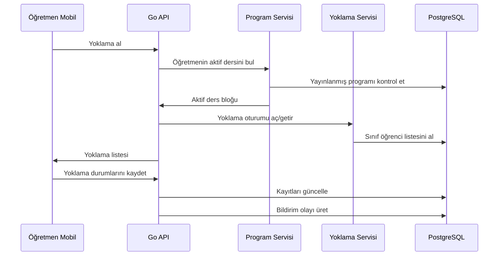

# Akıllı Yoklama

## Amaç

Öğretmenin sınıf, ders veya saat seçmek zorunda kalmadan doğru yoklama ekranına ulaşmasını sağlamaktır. Sistem, öğretmenin o anda hangi derste ve hangi sınıfta olması gerektiğini yayınlanmış ders programına göre tespit eder.

## Temel Akış

## Aktif Ders Bulma Kuralı

Sistem şu bilgileri kullanır:

- Öğretmen kullanıcı ID'si
- Kurum timezone bilgisi
- Yayınlanmış aktif ders programı
- Gün ve saat
- Tolerans penceresi

Önerilen tolerans:

- Ders başlangıcından 10 dakika önce
- Ders bitişinden 10 dakika sonra

Bu pencere kurum ayarı yapılabilir.

## Olası Durumlar

### Tek Aktif Ders Bulundu

Doğrudan öğrenci listesi açılır.

### Aktif Ders Bulunamadı

Öğretmene bugünkü dersleri gösterilir ve manuel seçim izni verilebilir. Bu durum audit veya kullanım loguna yazılmalıdır.

### Birden Fazla Aday Bulundu

Bu normalde program verisi hatasıdır. Öğretmene seçim yaptırılır, yönetici dashboard'unda veri tutarsızlığı uyarısı üretilir.

### Yayınlanmış Program Yok

Öğretmen yoklama alamaz veya yönetici tarafından izin verilmişse manuel sınıf seçimi ile alabilir. MVP için önerilen davranış: yöneticiye program eksik uyarısı üretmek.

## Yoklama Durumları

- `present`: Geldi
- `absent`: Gelmedi
- `late`: Geç geldi
- `excused`: İzinli
- `unknown`: Henüz işaretlenmedi

## Veri Kuralları

- Bir ders bloğu için aynı öğretmen ve sınıfa ait tek aktif yoklama oturumu olmalıdır.
- Yoklama kaydı öğrenci bazında tekil olmalıdır.
- Sonradan yapılan değişiklikler audit log'a yazılmalıdır.
- Veliye bildirim göndermek için yoklama kaydı kesinleşmiş olmalıdır.

## Veli Bildirimi

MVP'de devamsızlık bildirimi şu şekilde ele alınabilir:

- Yoklama kaydı `absent` veya `late` ise bildirim olayı oluşturulur.
- Bildirim servisi veli mobil uygulamasına push bildirimi gönderir.
- Push başarısız olursa uygulama içi bildirim kalır.
- Bildirim gönderim durumu `attendance_notifications` tablosunda izlenir.

## Kullanıcı Deneyimi İlkeleri

- Öğretmen yoklama ekranına en fazla iki aksiyonla ulaşmalıdır.
- Öğrenci listesi hızlı açılmalıdır.
- Toplu "hepsi geldi" aksiyonu olmalıdır.
- Değişiklik kaydedilmeden çıkışta uyarı verilmelidir.
- Offline destek ilk MVP'de zorunlu değildir; ancak API tasarımı ileride offline kuyruğa uyumlu olmalıdır.

