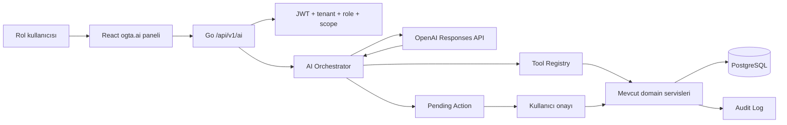

# ogta.ai Komut Asistanı Tasarımı

> Tarih: 2026-05-25  
> Kapsam: Müdür, öğretmen, veli ve rehberlik hesaplarında konuşarak işlem yaptıran `ogta.ai` yapay zeka katmanı.  
> Hedef: Kullanıcının doğal dille verdiği komutları yetki, kapsam, onay ve audit kurallarıyla güvenli biçimde gerçek sistem aksiyonlarına çevirmek.

**Rol eşleştirmesi (kod tabanı):** `müdür` → `principal`, `rehberlik öğretmeni` → `guidance`, `veli` → `guardian`, `öğretmen` → `teacher`. Bölüm 7–8 ve 15. bölümdeki kabul kriterleri dört rolün tamamını kapsar; ilk teknik PR (§16) yalnızca öğretmen gözlem akışını teslim eder, diğer roller aynı altyapı üzerine Faz 3–4’te eklenir.

---

## 1. Ürün Hedefi

`ogta.ai`, ÖTS içinde ayrı bir sohbet ürünü değil; mevcut okul operasyonlarını hızlandıran komut asistanıdır.

Kullanıcı şunu yazabilmelidir:

> Birkan Atmaca adlı öğrenciye analiz raporu girmeni istiyorum. Dikkat sorunu var, derste başka şeylere odaklanıyor.

Asistan doğrudan kayıt yazmamalıdır. Önce yetkili öğrenci adayını bulmalı, kullanıcıya göstermeli, notu yapılandırmalı, riskli ifadeleri yumuşatmalı, açık onay almalı ve ancak backend servisleri üzerinden kayıt oluşturmalıdır.

Doğru davranış:

1. Öğrenciyi kullanıcının kapsamına göre arar.
2. Bir veya daha fazla aday dönerse kullanıcıdan seçim ister.
3. Notu kategori, metin, hassasiyet ve bağlam olarak taslaklar.
4. Kullanıcıdan açık onay alır.
5. Backend action endpoint'i üzerinden kaydı oluşturur.
6. Audit log yazar.
7. Sonucu kısa ve izlenebilir şekilde bildirir.

Yanlış davranış:

- Modelin kendi başına veritabanı yazması.
- Yetki kontrolünü modele bırakmak.
- Veliye başka öğrencinin bilgisini göstermek.
- Öğrenciye klinik tanı koymak.
- Hassas rehberlik verisini genel sohbet cevabına dökmek.
- Kullanıcı onayı olmadan gözlem, rehberlik notu, yoklama veya duyuru oluşturmak.

---

## 2. Mevcut Sistemde Durum

Kod tabanı `ogta.ai` için bazı ön hazırlıklara sahip, fakat asistan modülü henüz yok.

Var olanlar:

- `platform_settings` içinde `ai_provider_key` gizli ayarı var.
- Admin ayarlarında "AI API Key" tanımı mevcut.
- Öğretmen gözlemleri, rehberlik notları, destek planları, yoklama, duyuru ve dashboard servisleri gerçek backend endpoint'lerine sahip.
- Rol ve tenant bağlamı JWT üzerinden geliyor.
- `user_scopes` tablosu öğretmen, rehberlik ve veli kapsamlarını taşımaya başlamış.

Eksikler:

- `backend/internal/app/ai` yok.
- `backend/internal/domain/ai` yok.
- OpenAI client yok.
- `POST /api/v1/ai/...` endpoint'leri yok.
- AI konuşma, mesaj, tool call ve pending action tabloları yok.
- Frontend'de ortak `OgtaAiDock` veya rol bazlı AI panel yok.
- Komutların açık onayla aksiyona dönüşmesini sağlayan güvenli action katmanı yok.

---

## 3. OpenAI API Yaklaşımı

Uygulama, OpenAI tarafında Responses API ile kurulmalıdır. Resmi dokümanlar Responses API'nin metin, araç kullanımı ve agentic akışlar için merkezi endpoint olduğunu; function calling'in modelin uygulama tarafındaki fonksiyonlara argüman üretmesini sağladığını anlatır.

Kullanılacak yaklaşım:

- Ana endpoint: OpenAI Responses API.
- Araç mekanizması: function calling.
- Çıktı disiplini: structured outputs / JSON schema.
- Hassas öğrenci verisi için: minimum veri gönderimi, mümkün olduğunda `store: false`.
- Model seçimi: config ile değiştirilebilir olmalı.

Önerilen config:

```text
OGTA_AI_PROVIDER=openai
OGTA_AI_MODEL=gpt-5.4-mini
OGTA_AI_REASONING_MODEL=gpt-5.5
OGTA_AI_FAST_MODEL=gpt-5.4-nano
OGTA_AI_STORE_RESPONSES=false
OGTA_AI_TIMEOUT_SECONDS=30
OGTA_AI_MAX_TOOL_STEPS=6
```

Not: Model adları hızlı değişebildiği için uygulamada model string'i koda gömülmemeli, admin ayarı veya environment üzerinden yönetilmelidir. Güncel model seçimi uygulamaya alınırken OpenAI'nin resmi model rehberi yeniden kontrol edilmelidir.

Resmi kaynaklar:

- [OpenAI Responses API docs](https://developers.openai.com/api/docs/guides/responses)
- [OpenAI function calling docs](https://developers.openai.com/api/docs/guides/function-calling)
- [OpenAI structured outputs docs](https://developers.openai.com/api/docs/guides/structured-outputs)
- [OpenAI latest model guide](https://developers.openai.com/api/docs/guides/latest-model)
- [OpenAI safety best practices](https://developers.openai.com/api/docs/guides/safety-best-practices)

---

## 4. Temel Mimari



Ana kural: OpenAI modeli yalnızca öneri ve araç argümanı üretir. Gerçek yazma işlemini sadece Go backend yapar.

Katmanlar:

- `http/handlers/handlers_ai.go`: AI konuşma ve action endpoint'leri.
- `app/ai`: konuşma orkestrasyonu, tool loop, onay yönetimi.
- `domain/ai`: conversation, message, pending action, tool call modelleri.
- `platform/openai`: OpenAI Responses API adapter'ı.
- `repository/postgres/store_ai.go`: AI tabloları.
- `frontend/.../OgtaAiDock.tsx`: ortak AI panel.

---

## 5. Konuşma Yaşam Döngüsü

### 5.1 Mesaj alma

Frontend `POST /api/v1/ai/conversations/{id}/messages` çağırır.

Backend şu bağlamı oluşturur:

- `tenant_id`
- `user_id`
- `role`
- `user_scopes`
- aktif dashboard yolu
- kullanıcının dil tercihi
- konuşma geçmişinden kısa özet

### 5.2 Niyet ve güvenlik

Asistan mesajı şu sınıflardan birine yerleştirir:

- `read_only`: bilgi sorma, özet isteme.
- `draft_action`: taslak oluşturma.
- `write_action`: kayıt oluşturma/güncelleme.
- `high_risk_action`: yayınlama, silme, hassas kayıt, yoklama değiştirme.
- `blocked`: yetki dışı veya güvenlik dışı istek.

### 5.3 Tool çağırma

Model öğrenci aramak, yetkileri kontrol etmek veya taslak üretmek için tool çağrısı ister. Backend tool'u çalıştırır ve sonucu modele döner.

Önemli: Tool sonuçlarında gereksiz kişisel veri dönülmez. Örneğin öğrenci arama sonucu şunlarla sınırlı olmalıdır:

```json
{
  "students": [
    {
      "id": "student_uuid",
      "fullName": "Birkan Atmaca",
      "className": "5-A",
      "schoolNumber": "124"
    }
  ]
}
```

### 5.4 Onay

Yazma işlemi gereken her durumda backend önce `ai_pending_actions` kaydı oluşturur.

Kullanıcıya action kartı gösterilir:

```text
Öğrenci: Birkan Atmaca - 5-A
İşlem: Öğretmen gözlem kaydı oluşturma
Kategori: Dikkat durumu
Not: Derste dikkatini sürdürmekte zorlandığı ve etkinlik sırasında farklı nesnelerle ilgilendiği gözlemlendi.

[Onayla] [Vazgeç]
```

Onay geldiğinde frontend `POST /api/v1/ai/actions/{id}/confirm` çağırır. Backend action'ı tekrar yetki ve kapsam kontrolünden geçirir, sonra ilgili domain servisini çalıştırır.

---

## 6. Örnek Akış: Öğretmen Gözlem Kaydı

Kullanıcı:

```text
Birkan Atmaca adındaki öğrenciye analiz raporu girmeni istiyorum.
Dikkat dağınıklığı var, derste başka şeylerle oynuyor.
```

Asistanın iç akışı:

1. `search_students` tool'u çağrılır.
2. Sadece öğretmenin yetkili olduğu öğrenciler aranır.
3. Bir öğrenci bulunduysa kullanıcıya sorulur:

```text
Birkan Atmaca adlı 5-A sınıfındaki öğrenciyi buldum. Bu öğrenci için gözlem kaydı oluşturayım mı?
```

4. Kullanıcı `evet` der.
5. Asistan taslağı yapılandırır:

```json
{
  "actionType": "create_observation",
  "studentId": "student_uuid",
  "category": "attention",
  "note": "Derste dikkatini sürdürmekte zorlandığı ve etkinlik sırasında farklı nesnelerle ilgilendiği gözlemlendi.",
  "sensitivity": "sensitive_student"
}
```

6. Kullanıcıya son onay kartı gösterilir.
7. Kullanıcı `Onayla` der.
8. Backend `observation.Create` servisini çalıştırır.
9. `audit_logs` kaydı oluşur.
10. Asistan cevap verir:

```text
Gözlem kaydı oluşturuldu. Kategori: Dikkat durumu. Rehberlik birimi bu kaydı kendi panelinde görebilir.
```

Not: Asistan "dikkat eksikliği", "DEHB" veya klinik tanı gibi ifadeleri kesin tanı olarak kullanmamalıdır. Kullanıcının yazdığı ifade gözlem diline çevrilmelidir.

---

## 7. Rol Bazlı Yetenekler

### 7.1 Öğretmen

MVP yetenekleri:

- Kendi ders programını sorabilir.
- Aktif dersi ve yoklama durumunu sorabilir.
- Kendi yetkili öğrencilerini arayabilir.
- Kendi öğrencisi için gözlem kaydı taslaklayıp onayla oluşturabilir.
- Son kendi gözlemlerini özetletebilir.
- Duyuruları ve bildirimleri sorabilir.

Yapmamalı:

- Başka öğretmenin öğrencisine kayıt girmek.
- Rehberlik gizli notlarını okumak.
- Başka öğretmenin gözlem notlarını listelemek.
- Onaysız yoklama değiştirmek.

### 7.2 Rehberlik

MVP yetenekleri:

- Yetkili öğrencileri arayabilir.
- Öğretmen gözlemlerinden özet isteyebilir.
- Rehberlik notu oluşturabilir.
- Destek planı oluşturabilir.
- Öğrenci bazlı risk sinyallerini açıklatabilir.

Yapmamalı:

- Klinik tanı üretmek.
- Disiplin kararı vermek.
- Veliye otomatik hassas rapor göndermek.
- Müdürün görmemesi gereken gizli notları özet dashboard'a taşımak.

### 7.3 Müdür / Yönetici

MVP yetenekleri:

- Dashboard özetini sorabilir.
- Sınıf, devamsızlık, alınmamış yoklama ve duyuru durumlarını sorabilir.
- Duyuru taslağı oluşturabilir.
- Öğretmen, öğrenci ve sınıf arayabilir.
- Program üretimi için eksik veri kontrolü isteyebilir.

Yapmamalı:

- Rehberlik gizli notlarını varsayılan olarak okumak.
- Hassas öğrenci notlarını ham metin olarak genel rapora almak.
- Kullanıcı rol/scope değişikliği yaptırmak.

### 7.4 Veli

MVP yetenekleri:

- Kendi çocuğunun ders programını sorabilir.
- Kendi çocuğunun devamsızlık özetini sorabilir.
- Duyuru ve bildirimlerini sorabilir.
- Destek talebi taslağı oluşturabilir.

Yapmamalı:

- Başka öğrenci aramak.
- Öğretmen gözlem notlarının ham metnini görmek.
- Rehberlik gizli kayıtlarını görmek.
- Başka veli veya sınıf verisine erişmek.

---

## 8. Tool Registry Tasarımı

Her tool, backend tarafında normal domain servislerini kullanmalıdır. Tool'lar modele doğrudan SQL veya HTTP endpoint erişimi vermemelidir.

Başlangıç tool seti:

| Tool | Roller | Risk | Açıklama |
|------|--------|------|----------|
| `search_students` | teacher, guidance, principal, guardian | low | Role ve scope'a göre öğrenci arar |
| `get_student_brief` | teacher, guidance, principal, guardian | low/medium | Yetkiye göre sınırlı öğrenci özeti döner |
| `draft_observation` | teacher, guidance | medium | Gözlem taslağı üretir, DB yazmaz |
| `create_observation` | teacher, guidance | medium | Onaylanmış gözlem kaydı oluşturur |
| `draft_guidance_note` | guidance | high | Rehberlik notu taslağı üretir |
| `create_guidance_note` | guidance | high | Onaylanmış rehberlik notu oluşturur |
| `draft_support_plan` | guidance | high | Destek planı taslağı üretir |
| `create_support_plan` | guidance | high | Onaylanmış destek planı oluşturur |
| `get_attendance_summary` | principal, guidance, guardian, teacher | medium | Role/scope kontrollü devamsızlık özeti |
| `get_teacher_schedule` | teacher, principal | low | Öğretmen takvimini döner |
| `draft_announcement` | principal, system_admin | medium | Duyuru taslağı üretir |
| `create_announcement` | principal, system_admin | high | Onaylanmış duyuru oluşturur |
| `create_support_ticket` | all roles | medium | Destek talebi oluşturur |

Örnek tool şeması:

```json
{
  "type": "function",
  "name": "search_students",
  "description": "Kullanıcının rol ve kapsamına göre öğrenci arar.",
  "parameters": {
    "type": "object",
    "additionalProperties": false,
    "properties": {
      "query": { "type": "string" },
      "limit": { "type": "integer", "minimum": 1, "maximum": 5 }
    },
    "required": ["query"]
  }
}
```

Yazma tool'ları doğrudan model tarafından çağrılsa bile backend şu kontroller olmadan işlem yapmamalıdır:

- action ID var mı?
- action kullanıcıya mı ait?
- action süresi doldu mu?
- action argüman hash'i değişti mi?
- aynı tenant mı?
- rol ve scope hâlâ geçerli mi?
- işlem için açık onay geldi mi?

---

## 9. Veritabanı Tasarımı

Yeni migration önerisi: `backend/migrations/000010_ogta_ai.sql`

```sql
CREATE TABLE ai_conversations (
    id UUID PRIMARY KEY DEFAULT uuid_generate_v4(),
    tenant_id UUID NOT NULL REFERENCES tenants(id),
    user_id UUID NOT NULL REFERENCES users(id),
    role TEXT NOT NULL,
    title TEXT NOT NULL DEFAULT '',
    status TEXT NOT NULL DEFAULT 'active',
    created_at TIMESTAMPTZ NOT NULL DEFAULT now(),
    updated_at TIMESTAMPTZ NOT NULL DEFAULT now(),
    deleted_at TIMESTAMPTZ
);

CREATE TABLE ai_messages (
    id UUID PRIMARY KEY DEFAULT uuid_generate_v4(),
    tenant_id UUID NOT NULL REFERENCES tenants(id),
    conversation_id UUID NOT NULL REFERENCES ai_conversations(id) ON DELETE CASCADE,
    user_id UUID REFERENCES users(id),
    role TEXT NOT NULL,
    content TEXT NOT NULL,
    redacted_content TEXT NOT NULL DEFAULT '',
    model TEXT NOT NULL DEFAULT '',
    token_input INTEGER NOT NULL DEFAULT 0,
    token_output INTEGER NOT NULL DEFAULT 0,
    created_at TIMESTAMPTZ NOT NULL DEFAULT now()
);

CREATE TABLE ai_tool_calls (
    id UUID PRIMARY KEY DEFAULT uuid_generate_v4(),
    tenant_id UUID NOT NULL REFERENCES tenants(id),
    conversation_id UUID NOT NULL REFERENCES ai_conversations(id) ON DELETE CASCADE,
    message_id UUID REFERENCES ai_messages(id) ON DELETE SET NULL,
    tool_name TEXT NOT NULL,
    arguments JSONB NOT NULL DEFAULT '{}'::jsonb,
    result_summary JSONB NOT NULL DEFAULT '{}'::jsonb,
    status TEXT NOT NULL DEFAULT 'completed',
    created_at TIMESTAMPTZ NOT NULL DEFAULT now()
);

CREATE TABLE ai_pending_actions (
    id UUID PRIMARY KEY DEFAULT uuid_generate_v4(),
    tenant_id UUID NOT NULL REFERENCES tenants(id),
    conversation_id UUID NOT NULL REFERENCES ai_conversations(id) ON DELETE CASCADE,
    requested_by UUID NOT NULL REFERENCES users(id),
    action_type TEXT NOT NULL,
    risk_level TEXT NOT NULL,
    payload JSONB NOT NULL,
    payload_hash TEXT NOT NULL,
    status TEXT NOT NULL DEFAULT 'pending',
    confirmation_text TEXT NOT NULL DEFAULT '',
    confirmed_at TIMESTAMPTZ,
    cancelled_at TIMESTAMPTZ,
    expires_at TIMESTAMPTZ NOT NULL,
    created_at TIMESTAMPTZ NOT NULL DEFAULT now()
);

CREATE INDEX idx_ai_conversations_user ON ai_conversations (tenant_id, user_id, updated_at DESC);
CREATE INDEX idx_ai_messages_conversation ON ai_messages (tenant_id, conversation_id, created_at);
CREATE INDEX idx_ai_pending_actions_status ON ai_pending_actions (tenant_id, requested_by, status, expires_at);
```

Saklama politikası:

- Mesajlar varsayılan 90 gün saklanabilir.
- Hassas öğrenci metinleri için `redacted_content` alanı kullanılmalı.
- Rehberlik gizli kayıtları transcript içinde ham olarak tutulmamalı.
- Silinen konuşmalar soft delete olmalı.

---

## 10. API Tasarımı

```text
GET    /api/v1/ai/capabilities
POST   /api/v1/ai/conversations
GET    /api/v1/ai/conversations
GET    /api/v1/ai/conversations/{id}
POST   /api/v1/ai/conversations/{id}/messages
POST   /api/v1/ai/conversations/{id}/messages:stream
GET    /api/v1/ai/actions/{id}
POST   /api/v1/ai/actions/{id}/confirm
POST   /api/v1/ai/actions/{id}/cancel
```

Mesaj gönderme response örneği:

```json
{
  "data": {
    "message": {
      "id": "msg_uuid",
      "role": "assistant",
      "content": "Birkan Atmaca adlı öğrenciyi buldum. Bu öğrenci mi?"
    },
    "candidates": [
      {
        "kind": "student",
        "id": "student_uuid",
        "label": "Birkan Atmaca",
        "meta": "5-A / No: 124"
      }
    ],
    "pendingAction": null
  }
}
```

Onay bekleyen action response örneği:

```json
{
  "data": {
    "message": {
      "role": "assistant",
      "content": "Gözlem kaydı taslağını hazırladım. Onaylıyor musunuz?"
    },
    "pendingAction": {
      "id": "action_uuid",
      "actionType": "create_observation",
      "riskLevel": "medium",
      "summary": "Birkan Atmaca için dikkat durumu gözlemi oluşturulacak.",
      "confirmLabel": "Kaydı oluştur",
      "cancelLabel": "Vazgeç"
    }
  }
}
```

---

## 11. Frontend Tasarımı

Ortak bileşen:

```text
frontend/apps/web/src/role-dashboard/ai/
  OgtaAiDock.tsx
  OgtaAiMessageList.tsx
  OgtaAiComposer.tsx
  OgtaAiActionCard.tsx
  OgtaAiCandidatePicker.tsx
  ogtaAiApi.ts
  types.ts
```

Yerleşim:

- Tüm rol konsollarında sağ alt sabit "ogta.ai" düğmesi.
- Açıldığında dar panel, tam ekran mod ve mobil uyumlu drawer.
- Mesajlar streaming desteklemeli.
- Onay gereken işlemde mesajın altında aksiyon kartı görünmeli.
- Aday öğrenci seçimi kartla yapılmalı.
- Başarılı işlemden sonra ilgili sayfa verisi yenilenmeli.

Rol bazlı başlangıç önerileri:

Öğretmen:

- "Bugünkü derslerimi özetle"
- "Yoklama için aktif dersimi bul"
- "Öğrenci gözlemi ekle"

Rehberlik:

- "Bugünkü risk sinyallerini özetle"
- "Bir öğrenci için rehberlik notu oluştur"
- "Destek planı taslağı hazırla"

Müdür:

- "Bugünkü alınmamış yoklamaları göster"
- "Duyuru taslağı hazırla"
- "Program üretimi için eksikleri kontrol et"

Veli:

- "Çocuğumun bu haftaki programını göster"
- "Devamsızlık özetini açıkla"
- "Destek talebi oluştur"

---

## 12. Güvenlik ve KVKK İlkeleri

Bu modül küçük yaştaki öğrenci verileriyle çalışacağı için asistan güvenliği ürünün ana parçasıdır.

Zorunlu kurallar:

- Backend her tool çağrısında role/scope kontrolü yapar.
- Modelin verdiği `studentId`, `tenantId`, `userId` değerlerine güvenilmez.
- Frontend'den gelen `pendingAction.payload` yeniden doğrulanır.
- Yazma işlemleri onaysız çalışmaz.
- Hassas veriler prompt'a minimum seviyede konur.
- Rehberlik gizli notları genel özetlerde maskeleme olmadan kullanılmaz.
- Tool sonuçları transcript'e ham detayla değil, özetle kaydedilir.
- Tüm yazma işlemleri audit log'a düşer.
- AI çıktısı karar değil öneridir.

Yasak içerik ve davranış:

- Klinik tanı.
- Kesin psikolojik etiket.
- Disiplin yaptırımı.
- Otomatik veli bilgilendirmesi.
- Gizli notların yetkisiz özeti.
- Sistem prompt'unu veya API anahtarını açıklama.
- Yetki bypass önerileri.

---

## 13. Prompt Politikası

Sistem prompt'u kısa ama kesin olmalıdır.

Önerilen ana ilkeler:

```text
Sen ogta.ai'sın. ÖTS okul yönetim sistemi içinde çalışan operasyon asistanısın.
Kullanıcının rolü, tenant'ı ve kapsamı dışındaki verileri isteme, gösterme veya tahmin etme.
Veritabanı yazan her işlem için önce net bir taslak oluştur ve kullanıcının açık onayını iste.
Öğrenci davranışları için klinik tanı koyma; gözlem dili kullan.
Emin olmadığında soru sor. Birden fazla öğrenci adayı varsa seçim istemeden devam etme.
Kayıt oluştururken kullanıcının yazdığı notu daha ölçülebilir ve saygılı gözlem diline çevir.
```

Modelden beklenen aksiyon çıktısı structured schema ile sınırlanmalıdır:

```json
{
  "type": "object",
  "additionalProperties": false,
  "properties": {
    "assistantMessage": { "type": "string" },
    "needsUserConfirmation": { "type": "boolean" },
    "pendingActionType": {
      "type": ["string", "null"],
      "enum": ["create_observation", "create_guidance_note", "create_support_plan", "create_announcement", null]
    },
    "riskLevel": {
      "type": "string",
      "enum": ["low", "medium", "high", "blocked"]
    }
  },
  "required": ["assistantMessage", "needsUserConfirmation", "pendingActionType", "riskLevel"]
}
```

---

## 14. Uygulama Sırası

### Faz 1 - AI altyapı

- `platform/openai` client.
- Config ve `ai_provider_key` okuma yolu.
- AI domain modelleri.
- `ai_conversations`, `ai_messages`, `ai_tool_calls`, `ai_pending_actions` migrasyonu.
- Basit `POST /api/v1/ai/conversations/{id}/messages`.

### Faz 2 - Öğretmen gözlem akışı

- `search_students` tool'u.
- `draft_observation` tool'u.
- `create_observation` pending action.
- Öğretmen panelinde `ogta.ai` dock.
- Örnek Birkan Atmaca akışı için integration test.

### Faz 3 - Rehberlik akışları

- Rehberlik notu oluşturma.
- Destek planı oluşturma.
- Öğretmen gözlemlerinden yetkili özet çıkarma.
- Risk sinyali açıklama.

### Faz 4 - Müdür ve veli akışları

- Müdür dashboard Q&A.
- Duyuru taslak ve onay akışı.
- Veli program/devamsızlık Q&A.
- Veli destek talebi oluşturma.

### Faz 5 - Sertleştirme

- Prompt injection testleri.
- Role/scope negatif testleri.
- Web E2E testleri.
- Audit raporu.
- Rate limit ve maliyet limiti.
- Retention job.

---

## 15. Kabul Kriterleri

Öğretmen gözlem akışı:

- Öğretmen yalnızca kendi öğrencisini arayabilir.
- Aynı isimde iki öğrenci varsa seçim istemeden devam etmez.
- Gözlem kategorisi otomatik önerilir ama kullanıcı onayı alınır.
- Kayıt oluşturulmadan önce action kartı görünür.
- Onay olmadan `student_observations` kaydı oluşmaz.
- Onay sonrası kayıt rehberlik gözlem listesinde görünür.
- Audit log kaydı oluşur.
- Model klinik tanı üretmez.

Rehberlik akışı:

- Rehberlik notu ve destek planı onaylı action olarak oluşur.
- Gizli notlar transcript'e ham haliyle gereksiz yazılmaz.
- Yetkisiz öğrenci için tool sonucu `forbidden` döner.

Veli akışı:

- Veli sadece kendi çocuğuna ait özet alır.
- Öğretmen gözlem ham metni ve rehberlik gizli notu veliye gösterilmez.

Müdür akışı:

- Müdür genel operasyon özetleri alır.
- Hassas rehberlik notları varsayılan özetlere girmez.
- Duyuru yayınlama için açık onay gerekir.

---

## 16. İlk Teknik PR Kapsamı

En küçük değer üreten ilk PR şu olmalıdır:

1. `000010_ogta_ai.sql` migrasyonu.
2. `internal/domain/ai` modelleri.
3. `internal/app/ai` service iskeleti.
4. `internal/platform/openai` client interface.
5. `POST /api/v1/ai/conversations` ve `POST /api/v1/ai/conversations/{id}/messages`.
6. Sadece öğretmen için:
   - öğrenci arama,
   - gözlem taslağı,
   - pending action,
   - action confirm,
   - gözlem oluşturma.
7. Frontend `OgtaAiDock` ile öğretmen konsoluna bağlama.
8. Integration test:
   - öğretmen yetkili öğrencisine gözlem ekler,
   - yetkisiz öğrenci reddedilir,
   - onaysız action işlem yapmaz.

Bu PR tamamlandığında `ogta.ai` ürünün gerçek çalışan çekirdeğine sahip olur. Sonraki roller aynı action altyapısının üzerine eklenir.

---

## 17. Uygulama Durumu

> **2026-05-25:** Faz 1–5 uygulandı. Güncel durum, dosya haritası ve kalan eksikler için bkz. **[17-ogta-ai-durum-ve-eksikler.md](./17-ogta-ai-durum-ve-eksikler.md)**.
