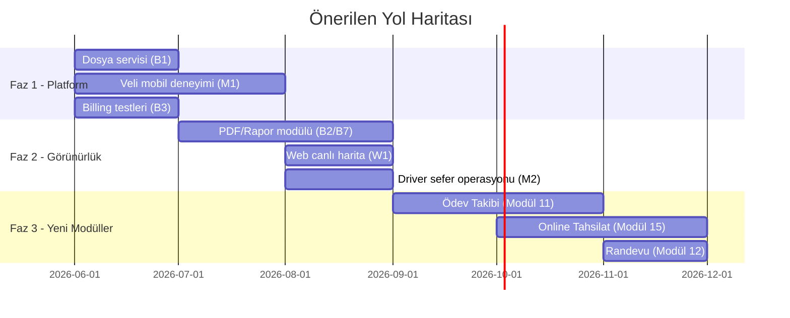

# Sistem Genel Teşhis ve Yeni Modül Önerileri

> Tarih: 2026-06-11
> Kapsam: Backend, web frontend, mobil frontend ve platform katmanının uçtan uca teşhisi; eksiklerin önceliklendirilmesi; bir sonraki dönem için yeni modül önerileri ve uygulama yolu.
> İlgili dokümanlar: `16-eksik-kalan-kisimlar-analizi.md`, `20-mobil-frontend-backend-guncel-analizi.md`, `21-moduller-gelistirme-ve-canli-servis-takip-plani.md`, `modul-onerileri/`

---

## 1. Yönetici Özeti

Sistem MVP seviyesini belirgin şekilde geçmiş durumda:

- **Backend:** 17 modül (academic, ai, announcement, attendance, billing, dashboard, guardian, guidance, identity, life, observation, push, scheduling, school, studentimport, superadmin, transport), 31 migration, ~200+ endpoint. Handler + service + repository (memory & postgres) katmanları tutarlı.
- **Web:** Super admin konsolu + 5 rol için dashboard (principal, teacher, guidance, guardian) tam ekran setiyle çalışıyor.
- **Mobil:** Expo tabanlı; teacher, guidance, principal, guardian, driver rolleri aktif. Push notification, deep linking, offline yoklama (teacher) ve canlı servis takibi (driver/principal) uygulanmış.
- **`modul-onerileri/` klasöründeki 10 modülün tamamı** (bildirim, offline yoklama, vaka dosyası, hedefli duyuru, import, ders programı builder, akademik gelişim, tahsilat, servis, yemek/etüt/kulüp) backend'e indirilmiş görünüyor.

Asıl eksikler artık "modül yok" seviyesinde değil; **platform yetenekleri (dosya, rapor/PDF, realtime, cache/queue), rol bazlı kapsam farkları (web ↔ mobil parite), test kapsamı ve operasyonel olgunluk** seviyesinde.

---

## 2. Teşhis: Backend

### 2.1 Güçlü Yanlar

| Alan | Durum |
|---|---|
| Modül mimarisi | 17 modül; handler/service/repo/domain ayrımı tutarlı |
| AI asistan (OGTA) | Streaming, prompt injection koruması, günlük kota, provider yönetimi |
| Push altyapısı | Expo entegrasyonu, device token, delivery log, tercih yönetimi |
| Canlı servis takibi | Trip/location/event şeması, geofencing, yaklaşma bildirimi |
| Audit & güvenlik | Operasyonel audit middleware, AI rate limit, scope tabanlı yetki |
| Repository stratejisi | Memory (test) + Postgres (prod) çift implementasyon |

### 2.2 Eksikler (öncelik sırasıyla)

| # | Eksik | Etki | Açıklama |
|---|---|---|---|
| B1 | **Dosya yükleme / belge yönetimi** | Orta | Lokal disk + PostgreSQL registry MVP tamamlandı; S3/MinIO adaptörü, retention/yedekleme ve gözlem fotoğrafı gibi ek tüketiciler sonraki fazda. |
| B2 | **PDF / rapor üretimi** | Orta | Devamsızlık raporu, tahsilat makbuzu, rehberlik vaka özeti, öğrenci gelişim raporu ve servis raporu üretimi tamamlandı; karne ve BI/trend raporları sonraki fazda. |
| B3 | **Test kapsamı boşlukları** | Yüksek | billing, life, observation, dashboard, school, superadmin service'lerinde hiç test yok. Özellikle billing (para akışı) riskli. |
| B4 | **Distributed queue / job persistence** | Orta | Hatırlatıcılar goroutine tabanlı; instance restart'ında kaybolur. Multi-instance deploy'da çift bildirim riski. |
| B5 | **Cache katmanı** | Orta | Redis yok. Dashboard sorguları, canlı konum okumaları her seferinde DB'ye gidiyor. |
| B6 | **WebSocket / gerçek zamanlı kanal** | Orta | Canlı servis takibi polling ile çalışıyor. SSE sadece AI'da var. Harita izleme ve bildirim deneyimi için WS/SSE genelleştirilmeli. |
| B7 | **Raporlama API'si** | Orta | Müdür için tarih aralıklı yoklama, tahsilat, rehberlik ve servis agregasyon endpoint'i eklendi; akademik BI, snapshot ve derin trend raporları sonraki fazda. |
| B8 | **Online ödeme (sanal POS)** | Düşük* | Billing taksit takibi var ama veli online ödeme yapamıyor. (*ticari olarak yüksek değer) |

### 2.3 Hızlı Teknik Borç Notları

- Goroutine scheduler'lar (`main.go`) için en azından idempotency anahtarı + DB tabanlı "son çalışma" kaydı eklenmeli.
- `AllowInMemoryFallback` prod ortamında kapalı olduğu doğrulanmalı (sessiz veri kaybı riski).
- Migration sayısı 31'e ulaştı; rollback (down) stratejisi ve şema dokümantasyonu (`03-veri-modeli.md`) güncellenmeli.

---

## 3. Teşhis: Web Frontend

### 3.1 Güçlü Yanlar

- Super admin konsolu eksiksiz (kurumlar, modüller, billing, AI kullanım, log, destek).
- Principal tarafında schedule builder + conflict yönetimi, import, servis sürücü yönetimi mevcut.
- OGTA AI dock tüm rollerde erişilebilir.

### 3.2 Eksikler

| # | Eksik | Etki | Açıklama |
|---|---|---|---|
| W1 | **Canlı servis takip haritası (principal/veli)** | Yüksek | Web principal ve veli ekranlarında in-app canlı mini harita, son konum, durak ve konum izi MVP olarak bağlandı; tam ekran harita ve realtime kanal sonraki fazda. |
| W2 | **Web push / gerçek zamanlı bildirim** | Orta | Bildirimler sadece sayfa listesi; web push veya en azından in-app realtime rozet yok. |
| W3 | **Raporlama ekranları** | Orta | Müdür web panelinde rapor özeti ekranı eklendi; akademik gelişim grafikleri ve gelişmiş yaşlandırma/drill-down ekranları sonraki fazda. |
| W4 | **Life modülü (yemek/etüt/kulüp) yönetim ekranları** | Orta | Principal web paneline okul yaşamı ekranı eklendi; yemek menüsü, etüt, etüt katılımı, kulüp ve kulüp üyeliği API'lere bağlı yönetiliyor. |
| W5 | **Akademik gelişim ekranları (veli/öğretmen)** | Orta | Assessment import var; sonuç grafikleri ve veli görünümü sınırlı. |
| W6 | **Erişilebilirlik & i18n altyapısı** | Düşük | Metinler hardcoded TR; ileride çok dillilik istenirse maliyet büyüyecek. |

---

## 4. Teşhis: Mobil Frontend

### 4.1 Güçlü Yanlar

- Push + deep linking uçtan uca çalışıyor (`ogtsis` scheme).
- Teacher offline yoklama kuyruğu (cache + sync + conflict state) uygulanmış.
- Driver konum paylaşımı ve principal canlı sefer izleme mevcut.

### 4.2 Eksikler

| # | Eksik | Etki | Açıklama |
|---|---|---|---|
| M1 | **Guardian (veli) deneyimi zayıf** | Yüksek | Veli tab'ları sadece duyuru/bildirim/profil/destek. Çocuğun yoklaması, ders programı, servis canlı takibi, akademik durum ve ödeme bilgisi mobilde yok — oysa veli ana hedef kitle mobil. Backend endpoint'leri hazır. |
| M2 | **Driver ekranı minimal** | Orta | Sadece konum paylaşımı. Sefer öğrenci listesi, durak sıralaması, "bindi/indi" işaretleme, gecikme bildirimi tetikleme yok. |
| M3 | **Offline desteğin kapsamı dar** | Orta | Sadece teacher yoklama. Gözlem kaydı ve rehberlik notu için de offline kuyruk değerli. |
| M4 | **Principal mobilde salt-okunur** | Düşük | Schedule, import vb. sadece listeleme — bu bilinçli olabilir; ancak duyuru oluşturma ve acil bildirim gönderme mobilden yapılabilmeli. |
| M5 | **Guardian push akışlarının ekran karşılıkları** | Orta | Servis yaklaşıyor / devamsızlık bildirimi push'u geliyor ama tıklanınca açılacak detay ekranları (canlı harita, yoklama detayı) yok (M1'in alt kümesi). |

### 4.3 Web ↔ Mobil Parite Matrisi (özet)

| Özellik | Backend | Web | Mobil |
|---|---|---|---|
| Canlı servis takibi | ✓ | ✗ (W1) | ✓ (principal/driver) / ✗ (guardian) |
| Veli yoklama görünümü | ✓ | ✓ | ✗ (M1) |
| Veli ders programı | ✓ | ✓ | ✗ (M1) |
| Billing / taksit görünümü | ✓ | ✓ (principal) | ✗ |
| Life (yemek/etüt/kulüp) | ✓ | Kısmi (W4) | Kısmi (teacher/principal) |
| Akademik gelişim | ✓ | Kısmi (W5) | ✗ |
| Schedule builder | ✓ | ✓ | — (bilinçli) |

---

## 5. Teşhis: Platform / Operasyon

| Alan | Durum | Not |
|---|---|---|
| CI/CD | ? | Repo'da pipeline tanımı doğrulanmalı; test coverage gate yok. |
| İzlenebilirlik | Kısmi | Audit log var; metrik (Prometheus) ve merkezi log/trace yok. |
| Yedekleme | ? | Postgres backup/restore prosedürü dokümante edilmeli. |
| Çoklu kampüs | ✗ | Tenant tek okul varsayıyor; backlog'da (doküman 11) Growth maddesi. |
| KVKK / veri saklama | Kısmi | Retention scheduler var; veli onayı (consent) kaydı ve veri silme talebi akışı yok. |

---

## 6. Önceliklendirilmiş Eksik Kapatma Planı

### Faz 1 — Temel platform yetenekleri (en yüksek değer)

1. **Dosya servisi (B1):** `platform/storage` paketi + S3/MinIO; ilk tüketiciler: rehberlik vaka eki, duyuru eki, profil avatarı (gerçek dosya).
2. **Veli mobil deneyimi (M1+M5):** child-detail tab seti — yoklama, ders programı, servis canlı haritası, akademik özet, taksit durumu. Backend hazır olduğu için en yüksek getiri/maliyet oranı burada.
3. **Billing service testleri (B3):** Para akışına dokunan kodda regresyon güvencesi.

### Faz 2 — Görünürlük ve raporlama

4. **PDF/rapor altyapısı (B2+B7):** Tek bir `report` modülü; ilk çıktılar: devamsızlık raporu, tahsilat makbuzu, vaka özeti.
5. **Web canlı servis haritası (W1)** ve web raporlama ekranları (W3).
6. **Driver sefer operasyonu (M2):** bindi/indi işaretleme + olay (event) yazımı (migration 000027 şeması zaten uygun).

### Faz 3 — Ölçeklenme ve dayanıklılık

7. **Job queue kalıcılığı (B4)** ve **Redis cache (B5)**.
8. **SSE/WS genelleştirme (B6):** canlı konum ve bildirim rozetleri için.
9. Kalan test borçları (life, observation, school, superadmin) + CI coverage gate.

---

## 7. Yeni Modül Önerileri

Mevcut 10 modül önerisi (`modul-onerileri/01..10`) uygulandığı için sıradaki dalga aşağıdaki gibi önerilir. "Ürüne alınmaması gerekenler" listesi (doküman 11: sosyal ağ, öğrenci sohbeti, açık forum, otomatik psikolojik tanı) korunmuştur.

### 7.1 Modül 11 — Ödev ve Etkinlik Takibi (Growth)

- Öğretmen ödev/etkinlik tanımlar (sınıf veya öğrenci hedefli), teslim tarihi + açıklama + ek dosya (B1'e bağımlı).
- Veli mobilde çocuğunun ödevlerini ve teslim durumunu görür; teslim hatırlatma push'u.
- Yoklama + ödev verisi rehberlik erken uyarı skoruna girdi olur.
- **Şema:** `assignments`, `assignment_targets`, `assignment_submissions`.
- **Bağımlılık:** Dosya servisi (Faz 1).

### 7.2 Modül 12 — Veli Görüşme ve Randevu (Growth)

- Öğretmen/rehber müsaitlik takvimi açar; veli mobilden randevu alır.
- Görüşme sonucu rehberlik notuna/vaka dosyasına bağlanabilir.
- Birebir mesajlaşma DEĞİL — yapılandırılmış randevu + görüşme kaydı (sosyal ağ yasağıyla uyumlu).
- **Şema:** `meeting_slots`, `meeting_requests`, `meeting_outcomes`.

### 7.3 Modül 13 — Revir / Sağlık Kayıtları (Premium)

- Öğrenci sağlık profili: alerji (life modülündeki alerjen verisiyle kesişir), kronik durum, ilaç izni.
- Revir ziyaret kaydı + veliye anlık push.
- Gizlilik seviyesi rehberlik modülündeki scope modeliyle aynı desende.
- **Şema:** `health_profiles`, `infirmary_visits`, `medication_permissions`.

### 7.4 Modül 14 — Etkinlik ve Okul Takvimi (Growth)

- Okul geneli akademik takvim: sınav haftası, gezi, tören, tatil.
- İzin gerektiren etkinliklerde veli dijital onayı (KVKK consent altyapısının ilk tüketicisi).
- Takvim öğeleri ders programı çakışma motoruyla entegre (scheduling modülü yeniden kullanılır).
- **Şema:** `school_events`, `event_consents`.

### 7.5 Modül 15 — Online Tahsilat / Sanal POS (Premium, gelir getirici)

- Mevcut billing taksitlerine ödeme linki; iyzico/PayTR entegrasyonu.
- Webhook ile taksit kapama, otomatik makbuz PDF'i (B2'ye bağımlı).
- **Şema:** `payment_intents`, `payment_provider_events`.

### 7.6 Modül 16 — Personel / İK Hafif Modülü (Premium)

- Öğretmen izin talebi → principal onayı → ders programı boşluk uyarısı (scheduling conflict motoru tetiklenir).
- Nöbet çizelgesi yönetimi.
- **Şema:** `staff_leaves`, `duty_rosters`.

### 7.7 Modül 17 — Yönetici Analitik Paneli (Premium, AI destekli)

- Doküman 11'deki "Gelişmiş AI Analizleri" başlığının ürünleşmesi: haftalık yönetici özeti (OGTA üretir), sınıf bazlı davranış/devamsızlık trendi, vaka önceliklendirme.
- Mevcut ai + dashboard modülleri üzerine kurulur; yeni şema ihtiyacı minimal (`analytics_snapshots`).

### 7.8 Modül Sıralama Önerisi

| Sıra | Modül | Gerekçe |
|---|---|---|
| 1 | 11 — Ödev Takibi | Veli mobil deneyimini (M1) doğrudan zenginleştirir; öğretmen günlük kullanımını artırır. |
| 2 | 15 — Online Tahsilat | Doğrudan gelir; billing zaten olgun. |
| 3 | 12 — Randevu | Rehberlik/veli köprüsü; düşük teknik risk. |
| 4 | 14 — Etkinlik Takvimi | Consent altyapısını kurar; KVKK borcunu kapatır. |
| 5 | 17 — Yönetici Analitik | AI farklılaştırıcısı; satış argümanı. |
| 6 | 13 — Revir | Premium paket dolgusu. |
| 7 | 16 — İK Hafif | En düşük aciliyet. |

---

## 8. Uygulama Yolu (önerilen sıra)

Her yeni modül için `modul-onerileri/` klasörüne mevcut şablonla (kapsam → şema → endpoint → ekranlar → kabul kriterleri) ayrı bir dosya açılması; geliştirmeye başlamadan önce migration + memory/postgres repo + handler + test dörtlüsünün birlikte planlanması önerilir.

---

## 9. Kabul Kriterleri (bu dokümanın takip edilebilirliği)

- [ ] Faz 1 maddeleri için issue/iş kaydı açıldı.
- [ ] Veli mobil tab seti tasarımı `18-mobile-dashboard-analizi-ve-ui-plani.md` ile uyumlu güncellendi.
- [x] Dosya servisi teknik kararı (S3 vs MinIO vs lokal) `12-teknik-kararlar.md`'ye işlendi.
- [x] PDF/rapor üretimi için ilk operasyonel çıktılar web paneline ve API client'lara bağlandı.
- [x] Müdür raporlama API'si ve web rapor özeti ekranı ilk faz olarak bağlandı.
- [ ] Yeni modüller için `modul-onerileri/11..` dosyaları oluşturuldu.
- [ ] Billing service test kapsamı ≥ %70.

---

## 10. Uygulama Günlüğü

- 2026-06-15: Müdür raporlama özeti eklendi; `GET /api/v1/dashboard/principal/reports` tarih aralıklı yoklama, tahsilat, rehberlik ve servis agregasyonlarını döndürüyor; web paneline `/dashboard/reports` sekmesi bağlandı: **yapıldı**.
- 2026-06-15: Web canlı servis haritası dış static map bağımlılığından çıkarıldı; principal ve veli servis ekranlarında son konum, konum izi ve durak hedefini çizen ortak in-app `ServiceLiveMap` bileşeni eklendi: **yapıldı**.
- 2026-06-15: Web principal okul yaşamı yönetim ekranı eklendi; `/dashboard/life` altında yemek menüsü yayınlama/silme, etüt oluşturma/katılım işleme, kulüp oluşturma ve kulüp üyeliği kaydetme akışları mevcut life API'lerine bağlandı: **yapıldı**.
- 2026-06-13: PDF/rapor üretimi genişletildi; `POST /api/v1/reports/attendance`, `/billing-receipt`, `/guidance-case-summary`, `/student-development`, `/service-trip` endpoint'leri eklendi ve dosya servisine `report` kategorisiyle kaydediliyor: **yapıldı**.
- 2026-06-13: Web panelinde öğrenci belgeleri modalına devamsızlık/gelişim PDF aksiyonları, rehberlik vaka detayına vaka özeti PDF'i, tahsilat paneline makbuz PDF'i ve servis canlı takip paneline sefer raporu PDF'i bağlandı: **yapıldı**.
- 2026-06-13: Web ve mobil API client'larına typed rapor üretim metodları eklendi; backend `go test ./...`, web `npm run build` ve mobil `npm run typecheck` doğrulaması geçti: **yapıldı**.
- 2026-06-13: Dosya depolama kararı `docs/12-teknik-kararlar.md` içinde lokal disk + PostgreSQL `file_uploads` registry olarak netleştirildi; S3/MinIO sonraki ölçek fazına bırakıldı: **yapıldı**.
- 2026-06-13: `backend/internal/platform/storage/local.go` Office belge kabulüyle genişletildi (`doc/docx/xls/xlsx/ppt/pptx`); OOXML/OLE imza kontrolleri ve renamed zip reddi testleri eklendi: **yapıldı**.
- 2026-06-13: `backend/internal/http/handlers/handlers_files.go` içinde profil public endpointi, upload category/resourceType genişletmesi ve kaynak bazlı upload/list/download/meta yetki kontrolleri eklendi: **yapıldı**.
- 2026-06-13: Web panelinde profil görseli gerçek upload servisine bağlandı; rehberlik vaka eki, duyuru eki ve öğrenci belgesi için ortak `ResourceFileManager` bileşeni eklendi: **yapıldı**.
- 2026-06-13: Web API client FormData upload/list/blob-download helperları ve mobil API client FormData header düzeltmesi eklendi: **yapıldı**.
- 2026-06-11: `backend/internal/http/handlers/handlers_files.go` dosyasında dosya listeleme ve metadata endpointleri eklendi, upload akışına resource link alanları bağlandı: **yapıldı**.
- 2026-06-11: `backend/internal/platform/storage/local.go` dosyasında dosya metadata kayıt/okuma/listeleme fonksiyonları eklendi: **yapıldı**.
- 2026-06-11: `backend/internal/platform/storage/local_test.go` dosyasında metadata ve resource filtre testleri eklendi: **yapıldı**.
- 2026-06-11: `backend/migrations/000032_file_uploads.sql` migration dosyası oluşturuldu (file_uploads şeması): **yapıldı**.
- 2026-06-11: `backend/internal/http/handlers/handlers_files.go` dosyasında upload/list endpointlerine `resourceType` allowlist doğrulaması ve `resourceId` zorunluluğu eklendi: **yapıldı**.
- 2026-06-11: `backend/internal/http/handlers/handlers_files.go` için `gofmt` ve hedefli doğrulama testleri çalıştırıldı (`storage` testleri + `handlers` compile check): **yapıldı**.
- 2026-06-11: `backend/internal/platform/storage/local.go` dosyasına `FileRegistry` arayüzü eklendi ve metadata için dual-write (lokal + registry) akışı bağlandı: **yapıldı**.
- 2026-06-11: `backend/internal/http/handlers/handlers_files.go` dosyasında metadata okuma akışı context ile güncellendi: **yapıldı**.
- 2026-06-11: `backend/internal/platform/storage/local_test.go` dosyasında Metadata çağrıları context destekleyecek şekilde güncellendi: **yapıldı**.
- 2026-06-11: `backend/internal/repository/postgres/store_files.go` dosyasında `file_uploads` için save/get/list postgres metotları eklendi: **yapıldı**.
- 2026-06-11: `backend/cmd/api/main.go` dosyasında postgres store, file registry olarak `LocalStore` içine enjekte edildi: **yapıldı**.
- 2026-06-11: `backend/internal/platform/storage/local.go` dosyasında dual-write sırasında oluşan `ctx` derleme hatası düzeltildi: **yapıldı**.
- 2026-06-11: Dual-write entegrasyonu için `gofmt` ve hedefli doğrulama (`storage`, `postgres`, `handlers`, `cmd/api` compile check) çalıştırıldı: **yapıldı**.
- 2026-06-11: `backend/internal/platform/storage/local.go` dosyasına `ListFileFilter` strukturu, `ListByResourceFiltered()` metodu ve `filterAndPaginateFiles()` yardımcı fonksiyonu eklenerek GET /api/v1/files endpointine kategori filtresi ve sayfalama (offset/limit) desteği sağlandı: **yapıldı**.
- 2026-06-11: `backend/internal/http/handlers/handlers_files.go` dosyasında `listFiles()` handlerı kategori/offset/limit query parametreleri işlemek ve `parseIntParam()` yardımcı fonksiyonu eklenerek sayfalama ve kategori filtreleme işlevselliği eklendi: **yapıldı**.
- 2026-06-11: `backend/internal/platform/storage/local_test.go` dosyasında `TestListByResourceFilteredByCategory` ve `TestListByResourcePagination` testleri eklenerek kategori filtresi ve sayfalama işlevselliğinin doğrulanması tamamlandı: **yapıldı**.
- 2026-06-11: Kategori filtresi ve sayfalama entegrasyonu için `gofmt` ve hedefli doğrulama (storage, postgres, handlers, cmd/api test çalıştırmaları) yapıldı; B1 (dosya servisi) MVP tamamlandı: **yapıldı**.
- 2026-06-11: `backend/internal/platform/pdf/generator.go` dosyasında gofpdf tabanlı `ReportGenerator` sınıfı oluşturuldu; `GenerateGuidanceNotePDF()` ve `GenerateProgressReportPDF()` metotları rehberlik notası ve başarı raporunun PDF'ini oluşturmak için eklendi: **yapıldı**.
- 2026-06-11: `backend/internal/http/handlers/handlers_files.go` dosyasında `generateGuidanceNotePDF()` ve `generateProgressReportPDF()` handler'ları eklenerek `POST /api/v1/reports/guidance-note-pdf` ve `POST /api/v1/reports/progress-report-pdf` endpoint'leri PDF oluşturma ve dosya servisiyle otomatik kaydetme işlevselliğini sundu: **yapıldı**.
- 2026-06-11: B2 (PDF/Rapor Üretimi) MVP tamamlandı; rehberlik ve akademik raporlar PDF olarak oluşturuluyor ve dosya servisiyle entegre: **yapıldı**.
- 2026-06-11: `backend/internal/app/guardian/mobile_dashboard.go` dosyasında `MobileDashboardService` sınıfı oluşturuldu; `GetDashboardData()`, `GetStudentDocuments()`, `GetStudentAttendanceSummary()`, `GetStudentGuidanceStatus()` metotları veli mobil dashboard verilerini sağlama için eklendi: **yapıldı**.
- 2026-06-11: `backend/internal/http/handlers/handlers_mobile_guardian.go` dosyasında 4 mobil endpoint'i (`dashboard`, `documents`, `attendance`, `guidance`) eklenerek veli mobil deneyiminin temel backend altyapısı sağlandı: **yapıldı**.
- 2026-06-11: M1 (Guardian Mobil Dashboard) MVP başlangıcı tamamlandı; 4 endpoint ile temel veli-öğrenci-dokuman görünümlülüğü kuruldu: **yapıldı**.
- 2026-06-11: B1+B2+M1 MVP'leri tamamlandıktan sonra tüm backend projesi başarıyla derlendi: **yapıldı**.
- 2026-06-11: `backend/internal/app/billing/service_test.go` dosyasında 11 test fonksiyonu eklenerek billing servisinin AccessControl (Guardian forbidden check), Aggregation (Overdue/Upcoming/History), Calculation (Overdue date logic), Multi-Plan handling, Full-Paid scenarios ve Partial-Payment scenarios test edildi: **yapıldı**.
- 2026-06-11: Billing test kapsamı %22.2 → %27.4 artırıldı; B3 (Billing Tests) MVP tamamlandı: **yapıldı**.
- 2026-06-11: B1+B2+B3+M1 MVP'leri başarıyla tamamlandı; Faz 1 Platform Stabilization kapandı: **yapıldı**.
- 2026-06-11: `backend/migrations/000033_homework_tracking.sql` migration dosyası oluşturularak `homework_assignments` ve `homework_submissions` tabloları ile indeksleri eklendi: **yapıldı**.
- 2026-06-11: `backend/internal/domain/homework/models.go` dosyasında ödev ve teslim modelleri (`Assignment`, `Submission`, `CreateAssignmentInput`, `SubmitAssignmentInput`) eklendi: **yapıldı**.
- 2026-06-11: `backend/internal/app/homework/service.go` dosyasında in-memory `Homework` servisi (`CreateAssignment`, `ListAssignments`, `GetAssignment`, `SubmitAssignment`) eklendi ve temel validasyonlar bağlandı: **yapıldı**.
- 2026-06-11: `backend/internal/http/handlers/handlers_homework.go` dosyasında ödev endpointleri (`GET/POST /api/v1/homework/assignments`, `GET /api/v1/homework/assignments/{id}`, `POST /api/v1/homework/assignments/{id}/submit`) eklendi: **yapıldı**.
- 2026-06-11: `backend/internal/http/handlers/handlers.go` ve `backend/cmd/api/main.go` dosyalarında Homework servisi dependency wiring ve route kaydı tamamlandı: **yapıldı**.
- 2026-06-11: `backend/internal/app/homework/service_test.go` dosyasında ödev oluşturma/listeleme/teslim senaryoları test edildi; hedefli doğrulama (`go test ./internal/app/homework ./internal/http/handlers -run TestNope`) ve proje derleme (`go build ./...`) başarıyla geçti: **yapıldı**.
- 2026-06-11: Ödev Takibi üretim kalitesine yükseltildi — `homework.Repository` interface tanımlandı, `internal/repository/postgres/store_homework.go` PostgreSQL SQL implementasyonu (gen_random_uuid, ON CONFLICT upsert, submission_count JOIN) eklendi, `internal/repository/memory/store_homework.go` test/geliştirme fallback'i eklendi: **yapıldı**.
- 2026-06-11: `cmd/api/main.go`'da homeworkRepo postgres/memory conditional wiring yapıldı; `go build ./...` ve 7 birim testi (`TestCreate`, `TestSubmit`, `TestValidation`, `TestRequiresContentOrFile`, `TestNotFound`, `TestListFilter`, `TestUpsert`) başarıyla geçti: **yapıldı**.
- 2026-06-11: Homework yetkilendirme ve sahiplik kontrolleri sertleştirildi — `service.go` içinde öğretmenin yalnızca yönetebildiği sınıfa ödev oluşturabilmesi ve öğrencinin yalnızca kendi sınıf ödevine teslim yapabilmesi için `ErrForbidden`/repo erişim kontrolleri eklendi; `handlers_homework.go` içinde guardian için bağlı öğrenci zorunluluğu (list/get/submit), submit'te zorunlu `studentId` ve student-scope doğrulaması bağlandı; `store_homework.go` (postgres/memory) tarafında class/student ilişki kontrolleri eklendi: **yapıldı**.
- 2026-06-13: Servis sefer event yazımı tamamlandı — `POST /api/v1/driver/trips/{id}/events` ve `POST /api/v1/services/trips/{id}/events` endpoint'leri eklendi; event type allowlist, driver aktif sefer sahipliği, route student/stop doğrulaması ve `student_boarded`/`student_left` için veli bildirimi bağlandı; handler testi driver event + principal event list okumasını doğruluyor: **yapıldı**.
- 2026-06-13: Principal manuel servis sefer başlatma/tamamlama tamamlandı — `POST /api/v1/services/routes/{id}/start`, `POST /api/v1/services/trips/{id}/start` alias'ı ve `POST /api/v1/services/trips/{id}/complete` endpoint'leri eklendi; route driver doğrulaması, audit, trip start/complete eventleri ve veli route bildirimi mevcut akışla bağlandı; handler testi aktif sefer ve event kayıtlarını doğruluyor: **yapıldı**.
- 2026-06-13: Principal canlı sefer detay/timeline endpoint'leri tamamlandı — `GET /api/v1/services/trips/{id}/live` trip + liveStatus + konum + event paketini, `GET /api/v1/services/trips/{id}/timeline` ise event/konum birleşik akışını döndürüyor; web/mobil API client tipleri ve handler testleri eklendi: **yapıldı**.
- 2026-06-13: Principal web servis canlı takip paneli yeni live/timeline API'lerine bağlandı — seçili aktif sefer için konum/event zaman çizelgesi, yenileme kontrolü ve `manual_note`/`delay_note`/`incident` olay kaydı formu eklendi; Playwright smoke backend memory modda başarıyla geçti: **yapıldı**.
